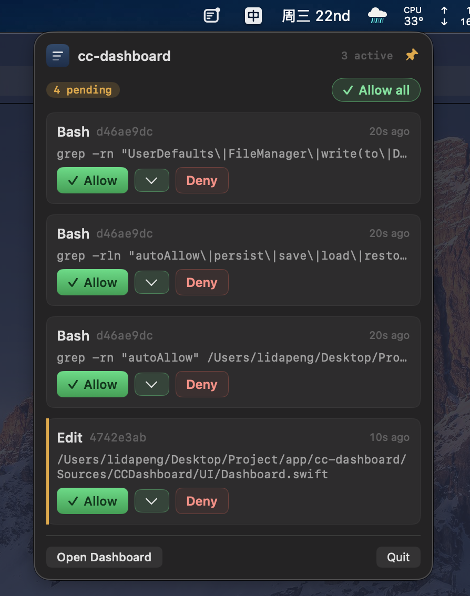

# cc-dashboard

English | [中文](README.zh-CN.md)

[](https://github.com/heypandax/cc-dashboard/actions/workflows/test.yml)
[](https://github.com/heypandax/cc-dashboard/releases/latest)
[](LICENSE)
[](#install)
[](https://swift.org)

Native macOS menu bar app that centralizes approvals across concurrent Claude Code sessions.

<p align="center">
  
</p>

## Why

Running more than one Claude Code session? Every write-capable tool call
hits a `y/n` prompt in whichever terminal spawned it. You end up either
toggling between windows chasing prompts, or widening `--permission-mode`
until it stops asking. cc-dashboard takes a third path: **one menu bar UI
where every session's pending approvals surface together**, with temporary
per-session trust windows when you want to hand off a stretch of work.

## Install

```bash
brew tap heypandax/cc-dashboard
brew install --cask cc-dashboard
```

Or grab the latest DMG from [Releases](https://github.com/heypandax/cc-dashboard/releases/latest).

First launch installs hooks into `~/.claude/settings.json` (the original
is backed up). Optionally `./install-launch-agent.sh` to start on login.
Updates are delivered automatically via [Sparkle](https://sparkle-project.org/);
there's a "Check for Updates…" item in the menu bar popover for manual
triggering.

Requires **macOS 14+**.

## Features

- **Three-state menu bar icon** (template image, auto-inverts for
  light/dark): `idle` · `pending` (filled dot) · `autoAllow` (hollow ring).
  Click to reveal the approval cards and active-session count.
- **Pinnable popover** — default is click-away-to-dismiss; click the pin
  in the header and it stays open across app / Space / fullscreen switches.
- **Main window** with session list (left) and approval queue (right);
  tool inputs are collapsible and the card edge is colored by risk.
- **Auto-allow (temporary trust)** — each approval offers "Allow for
  2 / 10 / 30 min" or a custom duration up to 24 h; subsequent
  `PreToolUse` calls from the same session pass through automatically
  within the window. Sidebar row shows a live countdown + cancel button.
- **Trust forever** — a top-level button next to "Allow" pins the
  session for unlimited auto-approval until you cancel it. Both trust
  modes persist across app quit / restart, keyed by project directory.
- **Allow all** (⌘↩) clears every pending approval at once.
- **Risk hints** — `rm -rf` / `sudo` / `curl | sh` / `/etc/*` `/usr/*`
  `/System/*` get a red edge; write-capable tools (`Edit` / `Write` /
  `MultiEdit` / `WebFetch`) get amber.
- **Native notifications** for incoming approvals, plus a "Reply ready"
  banner when a session finishes a turn — body shows your prompt
  (folded for long ones) so you can pick the right window when several
  sessions are running in parallel.
- **Embedded HTTP + WebSocket server** on `127.0.0.1:7788` — no Python /
  Node dependency.

## Keyboard shortcuts

| Shortcut | Context | Action |
|----------|---------|--------|
| ⌘↩ | main window approvals | Allow all pending |
| ⌘1 / ⌘2 / ⌘3 | "Trust forever ▾" submenu | trust this session for 2 / 10 / 30 min |
| ⌘Q | menu bar popover | Quit cc-dashboard |

## Privacy

cc-dashboard reports anonymous usage events and crash traces via Firebase
so the tool can be improved without anyone reading your code.

- **Reported**: approval events (tool name + risk level) + decision
  counts, symbolicated crash stacks, anonymous session + app version.
- **Never reported**: command strings, file paths, cwd, tool input
  contents, session IDs.

Opt out:

```bash
defaults write com.heypanda.cc-dashboard analyticsEnabled 0
```

## More

- [**Build from source + development**](CONTRIBUTING.md#local-development)
  — setup, tests, coding style.
- [**Architecture**](docs/architecture.md) — how it's put together, HTTP
  endpoints, hook flow.
- [**Releasing a signed build**](docs/release.md) — Apple notarization and
  DMG distribution.
- [**Security policy**](SECURITY.md) — reporting vulnerabilities privately.

## Uninstall

```bash
./install-hooks.sh --uninstall                     # remove hooks from ~/.claude/settings.json
./install-launch-agent.sh --uninstall              # remove auto-start
rm -rf ~/Library/Application\ Support/cc-dashboard # remove installed hook scripts
rm -rf dist/
```

LaunchAgent label: `com.heypanda.cc-dashboard`. Logs:
`~/Library/Logs/cc-dashboard/cc-dashboard.{out,err}.log`.

## License

MIT — see [LICENSE](LICENSE).
