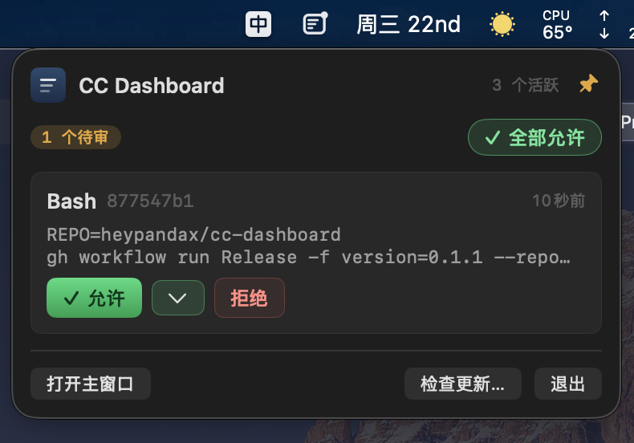

# cc-dashboard

[English](README.md) | 中文

[](https://github.com/heypandax/cc-dashboard/actions/workflows/test.yml)
[](https://github.com/heypandax/cc-dashboard/releases/latest)
[](LICENSE)
[](#安装)
[](https://swift.org)

原生 macOS 菜单栏 app,集中管理并发的 Claude Code 会话。

<p align="center">
  
</p>

## 为什么

同时跑 2+ Claude Code session 时,每个会写文件的工具调用都会在当初那个终端里
弹 `y/n` 提示 —— 你要么在多个终端之间切来切去,要么把 `--permission-mode` 放宽
到不再提示。cc-dashboard 走第三条路:**所有 session 的待审批都汇到一个菜单栏
UI 里**,再配合按会话的临时信任窗口,让你在一段时间里放手让它跑。

## 安装

```bash
brew tap heypandax/cc-dashboard
brew install --cask cc-dashboard
```

或直接下载最新 DMG:[Releases](https://github.com/heypandax/cc-dashboard/releases/latest)。

首次启动会把 hooks 装到 `~/.claude/settings.json`(自动备份原文件)。可选
`./install-launch-agent.sh` 开机自启。版本更新通过
[Sparkle](https://sparkle-project.org/) 自动推送,菜单栏弹窗也有
"Check for Updates…" 可手动触发。

要求 **macOS 14+**。

## 核心功能

- **菜单栏图标三态**(template image,深浅色自动反相):`idle` · `pending`
  (实心圆点) · `autoAllow`(空心圆环)。点开弹出审批卡片与活跃会话计数。
- **弹窗可 pin 常驻** —— 默认点外自动关;点 header 图钉后切 App / Space /
  全屏都不关。
- **主窗口**:左侧会话列表,右侧审批队列,工具入参可折叠,卡片左边条按
  风险染色。
- **Auto-allow(临时信任)** —— 审批卡片上可选"信任 2 / 10 / 30 min",
  也可输入最长 24 小时的自定义时长;窗口内同 session 的后续 PreToolUse
  自动放行。Session 行有倒计时 badge + 取消按钮。
- **永久允许(Trust forever)** —— "允许"右边一个独立按钮,把当前 session
  钉成无限信任,直到手动取消。两种信任都按项目目录(cwd)持久化,App
  退出 / 重启后自动恢复。
- **全部允许**(⌘↩)一键放行所有待审。
- **风险提示** —— `rm -rf` / `sudo` / `curl | sh` / `/etc/*` `/usr/*`
  `/System/*` 标红;`Edit` / `Write` / `MultiEdit` / `WebFetch` 标琥珀。
- **系统原生通知** —— 新审批弹窗,以及每轮对话结束后的"处理完成"通知,
  通知正文带上你刚才的提示词(过长会折叠),并行跑多个 session 时一眼
  就能知道哪个窗口该看了。
- **内嵌 HTTP + WebSocket server**(127.0.0.1:7788),无 Python / Node
  依赖。

## 快捷键

| 快捷键 | 场景 | 作用 |
|--------|------|------|
| ⌘↩ | 主窗口审批列表 | 全部允许 |
| ⌘1 / ⌘2 / ⌘3 | "永久允许 ▾" 子菜单 | 以 2 / 10 / 30 min 信任该 session |
| ⌘Q | 菜单栏弹窗 | 退出 cc-dashboard |

## 隐私

cc-dashboard 通过 Firebase 上报匿名使用事件与 crash 堆栈,方便持续修 bug
而不读你的代码。

- **上报**:审批事件(工具名 + 风险级别)+ 决策计数、已符号化的 crash
  堆栈、匿名会话 + app 版本。
- **不上报**:命令内容、文件路径、cwd、工具入参、session ID 任何部分。

关闭:

```bash
defaults write com.heypanda.cc-dashboard analyticsEnabled 0
```

## 更多(英文)

- [**从源码构建 + 开发**](CONTRIBUTING.md#local-development) —— 环境、测试、
  编码风格。
- [**架构**](docs/architecture.md) —— 内部组织、HTTP 端点、hook 流程。
- [**分发签名包**](docs/release.md) —— Apple 公证 + DMG 分发。
- [**安全策略**](SECURITY.md) —— 私下报告漏洞。

## 卸载

```bash
./install-hooks.sh --uninstall                     # 从 ~/.claude/settings.json 移除
./install-launch-agent.sh --uninstall              # 移除开机自启
rm -rf ~/Library/Application\ Support/cc-dashboard # 删掉已安装的 hook 脚本
rm -rf dist/
```

LaunchAgent label:`com.heypanda.cc-dashboard`,日志:
`~/Library/Logs/cc-dashboard/cc-dashboard.{out,err}.log`。

## License

MIT —— 见 [LICENSE](LICENSE)。
