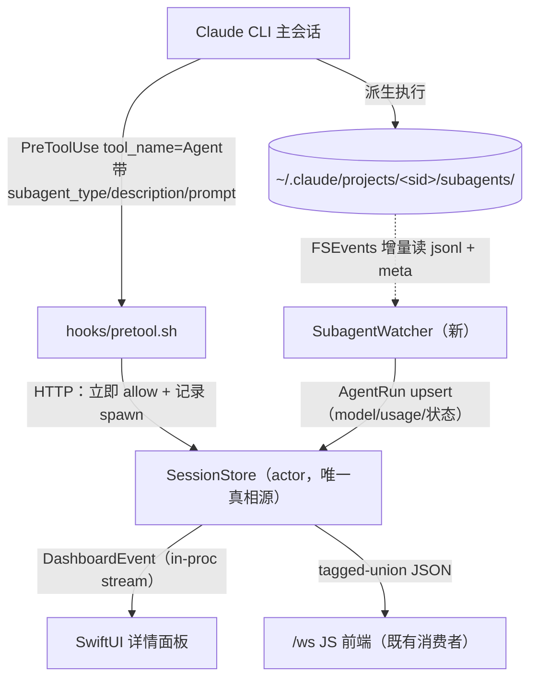

# Agent 信息集散中心 —— 设计文档

> 把 cc-dashboard 从「并发会话的审批工具」扩成「Claude Agent 团队的信息集散中心」：在一个只读、直观的界面里，看清主会话派生的 subagent 清单、执行细节、模型 / 模式 / 成本，并把审批动作收敛进会话列表。

状态：设计稿（待进入 plan mode 细化实现）。
关联需求：见文末「需求回溯表」。

---

## 1. 背景与目标

现状：cc-dashboard 拦截 `PreToolUse` 把并发会话的审批集中到一处。但用户在终端里仍有三类信息看不到、或看得很费劲：

1. 主会话派生了哪些 subagent —— 已完成 / 进行中 / 即将进行的清单与执行细节；
2. 每个 agent 的配置 —— 模型、权限模式、成本（出于安全审视的诉求）；
3. 终端要靠方向键翻页，小白希望有直观的**只读**信息视图。

外加一条信息架构建议：审批按钮收进会话列表，正文窗口腾出来放更丰富的信息。

目标不是再造一个报表系统，而是做**当下这一刻的操作态感知**：现在谁在跑、跑的是什么、烧了多少。历史聚合分析是工作区里 `claude-code-monitor`（OTel + Grafana）的活，本设计刻意不与其重叠（见 §10）。

---

## 2. 关键发现：数据契约（地基）

> 这一节是整份设计的地基。所有结论都用本机真实转录验证过，而非在线文档（在线资料有多处与实际不符，已纠正）。

### 2.1 subagent 在磁盘上的布局

每个主会话对应一个项目目录，subagent 各自一份独立转录 + 一个 meta 边车文件：

```
~/.claude/projects/<project-slug>/
├── <session_id>.jsonl                         主会话转录
└── <session_id>/
    ├── subagents/
    │   ├── agent-<agentId>.jsonl              子 agent 完整转录（含 model / usage）
    │   └── agent-<agentId>.meta.json          边车：关联 + 身份
    └── tool-results/<toolUseId>.txt           超大工具输出外溢（本设计不依赖）
```

**关键：路径无需自己拼 slug。** cc-dashboard 在每个 hook 里已拿到 `transcript_path`，subagents 目录可直接推导：

```swift
// transcript_path = .../<session_id>.jsonl  →  .../<session_id>/subagents
let subagentsDir = URL(fileURLWithPath: transcriptPath)
    .deletingPathExtension()
    .appendingPathComponent("subagents")
```

`SessionState.transcriptPath` 字段已存在（`Models.swift:19`），可直接复用。

### 2.2 关联链（已用真实数据证明）

```
父 transcript 的一条 assistant 消息
  └─ content[].tool_use { name:"Agent", id:"toolu_01VUAE…",
                          input:{ subagent_type, description, prompt } }
                                   │  id 相等
agent-<agentId>.meta.json { agentType, description, toolUseId:"toolu_01VUAE…" }
                                   │  文件名内嵌 agentId
agent-<agentId>.jsonl   records[] { agentId, isSidechain:true,
                                    message:{ model, usage:{…} } }
```

实测一例：父 `tool_use.id = toolu_01VUAE…` ↔ `meta.toolUseId` 完全相等，`subagent_type = claude-code-guide`、`description` 与派发时一致。**三段可双向对齐，agent 树可完整重建。**

### 2.3 字段可得性表

| 信息 | 来源 | 通道 | 可行性 |
|------|------|------|--------|
| subagent 类型 / 名字 | 父 `tool_use.input.subagent_type` ＝ `meta.agentType` | push + pull | ✅ |
| 任务描述 | `tool_use.input.description` ＝ `meta.description` | push + pull | ✅ |
| 完整 prompt | `tool_use.input.prompt` | push（hook payload 直达） | ✅ |
| spawn ↔ subagent 关联 | `tool_use.id` ＝ `meta.toolUseId`；文件名含 `agentId` | pull | ✅ |
| 真实模型 | 子转录 `message.model`（实测主 Opus、子 Haiku，会不同） | pull | ✅ |
| token / 成本 | 子转录每条 `message.usage` | pull | ✅（估算，见 §5） |
| 完成态 | 子转录末条 assistant `stop_reason:end_turn` | pull | ✅ |
| 进行中 | 子文件仍在追加 / 无终态记录 | pull | ✅ |
| 工具调用时间线 | 子转录逐条 `tool_use` | pull | ✅ |
| 权限模式 | 每个 hook 的 `permission_mode`（**父会话的**） | push | ⚠️ 仅父；子 frontmatter 的 override 不暴露 |
| 子 agent allowed tools | `.claude/agents/*.md` 定义文件 frontmatter | 另读文件 | ⚠️ hook / 转录都不给 |
| 即将进行（未启动） | 同回合多个 `Agent` tool_use、运行时串行排队的那些 | push | ⚠️ 仅批量并发派生时可见（见 §10） |

### 2.4 usage 字段形状（成本的原料）

子转录每条 assistant 消息带：

```json
"usage": {
  "input_tokens": 19830,
  "output_tokens": 5361,
  "cache_creation_input_tokens": 205910,
  "cache_read_input_tokens": 1159483
}
```

逐条累加即得单 agent 总量。注意 `cache_read` 量极大但单价极低 —— 计价必须分档，否则数字全错（见 §5）。

### 2.5 push 与 pull 的分工

- **push（hook，实时）**：`PreToolUse(tool_name=Agent)` 在派生的瞬间到达，带 `subagent_type / description / prompt`。这是「即将 / 正在进行」最快的信号，且子文件此刻可能还没生成。
- **pull（文件 watch，权威）**：subagents 目录给出 `model / usage / 完成态 / 工具时间线` —— 这些 hook 不给。

二者互补，都汇进 `SessionStore`，不另起真相源。

---

## 3. 架构设计

### 3.1 数据流



要点：

- **新增组件只有一个**：`SubagentWatcher`。其余沿用既有骨架 —— hook → `HookHandlers` → `SessionStore`（`actor`）→ `DashboardEvent` 流 → UI（`Dashboard.swift` 已订阅 `store.subscribe()`）。
- 新增的 `DashboardEvent` case 会**自动**经 `/ws` 流到既有 JS 前端（`HTTPServer.swift:113` 的 union 编码），零额外成本。
- watcher 只在「有活跃会话」时对其 subagents 目录开监听，会话 purge 时停（见 §8）。

### 3.2 Agent spawn：记录而非审批

把 `Agent`（及历史名 `Task`）加进 PreToolUse matcher 后，`preToolUse` 必须**特判**：派生 subagent 不是危险动作，不能塞进审批队列把每次 spawn 都卡 600s。

```swift
// HookHandlers.preToolUse 开头特判
if toolName == "Agent" || toolName == "Task" {
    await store.recordAgentSpawn(
        sessionID: input.sessionID,
        toolUseId: /* 见 §12 待验证：payload 是否带 tool_use id */ nil,
        subagentType: input.toolInput?["subagent_type"]?.display,
        description:  input.toolInput?["description"]?.display,
        prompt:       input.toolInput?["prompt"]?.display
    )
    return allowOutput(reason: "subagent spawn (recorded by cc-dashboard)")
}
```

> 默认「记录即放行」。是否对 subagent spawn 做审批是**未来可选项**（某些团队出于安全想拦），不在本期默认行为内 —— 呼应「按未来价值砍特性」。

---

## 4. 数据模型

### 4.1 新增类型（Swift 草图）

```swift
// Models.swift 追加

enum AgentRunStatus: String, Codable, Sendable {
    case spawning   // hook 已报 spawn，子文件尚未出现
    case running    // 子文件在追加
    case done       // 末条 assistant stop_reason=end_turn
    case error
}

struct TokenUsage: Codable, Sendable {
    var inputTokens = 0
    var outputTokens = 0
    var cacheCreationTokens = 0
    var cacheReadTokens = 0

    var totalTokens: Int { inputTokens + outputTokens + cacheCreationTokens + cacheReadTokens }
}

struct AgentRun: Codable, Sendable, Identifiable {
    let id: String            // agentId，如 a1d860fdf212b3953
    let sessionId: String     // 父会话
    let toolUseId: String?    // 关联父 tool_use；spawn 阶段可能先 nil，watcher 回填
    var agentType: String     // "Explore" / "claude-code-guide" / 自定义
    var description: String   // 一行任务描述
    var prompt: String?       // 完整 prompt（仅本机展示，永不上传，见 §7）
    var model: String?        // 子转录回填，可与父不同
    var status: AgentRunStatus
    var startedAt: Date
    var endedAt: Date?
    var usage: TokenUsage
    var estCostUSD: Double?   // 估算，标「≈」
    // var toolCalls: [AgentToolCall]   // Phase 2 时间线，先留空
}
```

### 4.2 `SessionState` 增量

```swift
// Models.swift，SessionState 追加（都来自既有 hook payload，只是没存）
var permissionMode: String?   // 每个 hook 都带，当前未落库（HookInput.permissionMode 已解析）
var model: String?            // 主会话模型；可由父转录回填，Phase 1 可选
```

`permission_mode` 现在收到了却没存（`HookInput.permissionMode` 有，`SessionState` 无）—— 落库 + 广播即可，近零成本。

### 4.3 新增 `DashboardEvent`

```swift
enum DashboardEvent: Sendable {
    // …既有 case 不动…
    case agentRunUpsert(AgentRun)                       // spawn / 进度 / 完成 统一走 upsert
    case agentRunsSnapshot(sessionId: String, runs: [AgentRun])
}
```

`subscribe()` 的首帧 snapshot（`SessionStore.swift:396`）需把当前所有 `AgentRun` 一并带上，保证新连接的 UI / `/ws` 客户端不丢历史。

### 4.4 `SessionStore` 状态

```swift
// 与 pendingApprovals 同构，按 sessionId 归集
private var agentRuns: [String: [String: AgentRun]] = [:]   // sessionId → agentId → run
```

新增 actor 方法：`recordAgentSpawn(...)`、`upsertAgentRun(_:)`（watcher 调用）、`agentRuns(forSession:)`、`allAgentRuns()`。purge 会话时一并清空其 `agentRuns`。

---

## 5. 成本计算

成本是**估算**，UI 一律标 `≈`。计价按「模型 × token 档位」查表：

```swift
struct ModelRate {            // 每百万 token 美元，示意值，以官方价为准
    let input: Double         // input_tokens
    let output: Double        // output_tokens
    let cacheWrite: Double    // cache_creation_input_tokens
    let cacheRead: Double     // cache_read_input_tokens
}
// 维护一张 [modelPrefix: ModelRate] 表，按 message.model 前缀匹配
// 例：opus ≈ {15, 75, 18.75, 1.5}；sonnet ≈ {3, 15, 3.75, 0.3}；haiku ≈ {1, 5, 1.25, 0.1}
```

注意点：

- `cache_read` 通常占 token 总量的绝大头（实测单 agent 116 万），但单价仅 input 的约 1/10 —— **分档是对的前提**，混算会把成本夸大一个数量级。
- 价目表会过时，集中放一处（可考虑 bundled JSON），便于改价。
- 未知模型前缀 → 不展示金额，只展示 token 数，避免拿错价算出误导数字。

---

## 6. UI 设计

### 6.1 信息架构调整（需求 4）

当前 `MainWindow`（`MainWindow.swift:15`）是 `NavigationSplitView`：左 `SessionListView`，右 `ApprovalQueueView`（**全局审批队列**，且未用 `selectedSession`）。

调整为：

- **左栏会话行**：承接审批动作 —— 有 pending 时行内直接给紧凑 `Allow / Deny`（复用 `ApprovalButtonSize.compact`），并保留醒目的 `N pending` 计数 + 状态 pulse。
- **右栏详情**：改为「选中会话的 Agent 信息中心」（只读），由 `selectedSession` 驱动。
- **跨会话兜底**：详情顶部保留一条细 bar，仅在有 pending 时显示 `N pending · Allow all`（保住既有批量动作与 ⌘↩ 快捷键，`Tokens.swift` 的 `DetailToolbar` 可改造复用）。

> ⚠️ 红线：审批是有时效的（shell 侧 600s 硬超时后回落到原生 TUI）。动作下沉到行内的同时，pending 的**响度不能降** —— 窗口标题 `· N pending`、菜单栏 popover、行内计数 + pulse 三处都保留。菜单栏快速审批面板（`StatusBarController` / `MenuBarView`）不动，仍是「离开主窗口也能秒批」的快路径。

### 6.2 详情面板：Agent Hub（需求 1 / 2 / 3）

```
┌─ 详情（选中会话） ──────────────────────────────────────────────┐
│  ● cc-dashboard            opus · default mode      [auto 4:12 ×] │  ← 会话头：名/模型/模式/信任
│  ~/Desktop/Project/app/cc-dashboard                              │
│  ───────────────────────────────────────────────────────────── │
│  AGENTS · 3                              本会话 ≈ $0.42 · 184k tok│  ← 会话级 rollup
│                                                                  │
│  ● Explore        Efficiency 评审            haiku   ⏱ 2.1s  done │  ← AgentRun 行
│       ≈ $0.01 · 25k tok                                  ▸        │     （▸ 展开时间线）
│  ◐ claude-code-guide  Research hook data     haiku   ⏱ running   │  ← 进行中（脉冲点）
│       ≈ $0.06 · 1.36M tok                                ▸        │
│  ○ Plan           设计实现方案                —       queued      │  ← 即将（仅批量派生可见）
│  ───────────────────────────────────────────────────────────── │
│  ▸ 展开后：工具调用时间线                                          │
│    14:20:03  Read   Models.swift                                 │
│    14:20:05  Bash   grep -r "agentId" …                          │
│    14:20:11  WebFetch  code.claude.com/docs/hooks                │
└──────────────────────────────────────────────────────────────────┘
```

- 状态点复用既有 `StatusDot`（`Sidebar.swift:6`）：`running` / `waitingApproval` 已有 pulse，`AgentRun` 的 `running` 沿用。
- 模型、`≈成本`、token 用既有 mono 字体 token（`CC.mono` / `CC.monoTiny`）；色彩走 `Tokens.swift` 的 `CC.*`，**不引入裸色值 / 裸 padding**（项目硬规则）。
- 行可展开为工具时间线（Phase 2）；默认折叠，呼应「直观、不需要复杂交互」。

### 6.3 会话行（左栏）加审批动作

```
┌─ 会话行 ────────────────────────────────┐
│ ● cc-dashboard            [auto 4:12 ×]  2m │
│   ~/…/app/cc-dashboard                       │
│   tool: Bash                    2 pending    │
│   ┌ Bash: rm -rf build/ ┐  [Allow] [Deny]   │  ← 有 pending 时行内展开紧凑审批
│   └──────────────────────┘                   │
└──────────────────────────────────────────────┘
```

复用 `ApprovalRow` 的按钮族（`AllowButton` / `DenyButton` 的 `.compact` 尺寸已就绪）。

---

## 7. 隐私与安全约束（红线）

- **`prompt` / `description` / `tool_input` / `cwd` / 命令 / 路径绝不进 Telemetry。** 这些正是 README、隐私政策、`CLAUDE.md` 明文承诺不上传的内容，也正好是 Agent Hub 要展示的丰富信息 —— 只能**留在本机内存与本地 UI**。
- Telemetry 仍只上传 `Telemetry.Event` / `Telemetry.Key` 的枚举 case（如「agent_hub_opened」「agent_run_count」这类计数），新增字段一律走枚举，不传原始串。
- watcher 只读本机 `~/.claude/projects/` 下的文件，不外发、不落第二份持久化。
- 不碰审批的 continuation 链（`requestApproval` / `resolveApproval`）—— 新增全是只读旁路，丢一个 continuation 会让审批永久挂死。

---

## 8. 性能考量

- **增量读，不全量 parse。** 最大的主转录已 2.7MB；子转录也可达数百 KB。watcher 对每个文件记 byte offset，FSEvents 触发后只读新增段、按行解析、累加 usage。
- **watch 生命周期绑定会话。** 仅对活跃会话的 subagents 目录开 `DispatchSource` 文件监听；`markSessionDone` → 10s grace → purge 时关闭监听，避免句柄泄漏与无谓 IO。
- **目录可能尚不存在**（会话还没派生任何 subagent）：监听父 `<session_id>/` 目录的创建，或低频兜底轮询，二选一在 Phase 0 spike 定。
- 解析失败（半行、并发写）容忍：跳过坏行，下次 offset 重试，不崩。

---

## 9. 边界与不做

- **「即将进行」有限。** 只有当主 agent **在一个回合里并发派生多个** subagent、且运行时按并发上限串行排队时，未启动的那些才可见（父转录已有 N 个 `Agent` tool_use，但 subagents 目录还没对应文件）。普通交互里主 agent 边想边派，**不预告下一个**，这部分无数据，不承诺。
- **子 agent 的 allowed-tools / 模型 override** 不在 hook / 转录里，要另读 `.claude/agents/*.md` frontmatter。Phase 1 不做，列为后续可选。
- **不做历史聚合 / 团队报表。** 那是 `claude-code-monitor`（OTel + Prometheus + Grafana）的职责。本设计只做「当下操作态」。分工：监控那边管**跨天跨人趋势**，cc-dashboard 管**此刻这台机器上谁在跑、烧了多少**。
- **不做交互式编排**（启停 agent、改派任务）—— 越界，且 hook 体系不支持。

---

## 10. 分期落地

| 阶段 | 内容 | 验收 |
|------|------|------|
| **P0 Spike** | matcher 加 `Agent\|Task`；`preToolUse` 特判「记录即放行」；写一次性解析器跑真实 subagents 目录；确认 §12 待验证项 | 能在日志里打出真实 agent 树（类型 / 模型 / token） |
| **P1 数据层** | `AgentRun` / `TokenUsage` 模型；`SubagentWatcher`；计价表；`SessionStore` 集成 + 新事件 + snapshot 带 agentRuns；fixtures 单测 | `swift test` 绿；`/ws` 能收到 `agent_run_upsert` |
| **P2 UI** | 详情面板 = Agent Hub（会话头 + rollup + AgentRun 行 + 可展开时间线，只读） | 选中会话即见其 agent 清单与 ≈成本 |
| **P3 信息架构** | 审批动作下沉左栏行内；详情顶细 bar 保 Allow-all；菜单栏不动 | 不漏 pending 的前提下正文腾给信息 |

每阶段独立可交付；P0 不过关则后续设计需回炉。

---

## 11. 测试策略

- 把本机一棵真实 subagents 目录（`<sid>/subagents/agent-*.jsonl` + `.meta.json`）脱敏后拷进 `Tests/CCDashboardTests/Fixtures`（`Package.swift` 已用 `resources:[.copy("Fixtures")]`）。
- `SubagentWatcher` 的解析 / 累加 / 完成判定走纯函数，注入固定 fixture 断言 `AgentRun` 结果。
- 时间相关逻辑沿用既有 `TestScheduler` 注入（`now()` / `delay()`），不引真实 sleep。
- usage 累加做边界用例：缺字段、半行、未知 model 前缀（应只出 token 不出金额）。

---

## 12. 待验证项（P0 Spike 收口）

1. **`PreToolUse(Agent)` payload 是否带 `tool_use` 的 id？** 若带，spawn 阶段即可拿 `toolUseId` 与 watcher 精确对齐；若不带，靠 `agentType + description + 时间窗`近似对齐，watcher 出文件后用 `meta.toolUseId` 校正。
2. **subagent 内部工具调用的实时 hook 是否带 `agentId`？** 当前 matcher 含 `Bash\|Edit\|Write\|MultiEdit\|WebFetch`，子 agent 跑这些会触发 hook。若 payload 带 `agentId`，可实时把调用归属到具体 subagent（更快）；若不带，靠 watcher 从子转录归属（更慢但完整）。设计已不依赖此项为真。
3. **是否值得加 `SubagentStop` 生命周期 hook** 作为完成的 push 信号（补 watcher 的 pull）。需确认其 payload 能否带 `agentId` 回关联。
4. **subagents 目录不存在时的监听策略**：监听父目录创建 vs 低频轮询，实测选一。
5. **matcher 改动两处同步**：`HooksInstaller.appendCCDashboard` 与 `install-hooks.sh` 都要改（`CLAUDE.md` 硬规则），且 `PreToolUse.timeout`(605s) / `--max-time`(600s) 配对不变。

---

## 13. 需求回溯表

| 用户需求 | 设计落点 | 可行性 |
|----------|----------|--------|
| 1 subagent 清单 + 执行细节（完成 / 进行中 / 即将） | §2 数据契约 + §3 watcher + §6.2 Agent Hub | ✅（「即将」有限，§9） |
| 2 配置：模型 / 模式 / 成本 | §4 模型字段 + §5 计价 + 会话头展示 | ✅ 模型/成本；⚠️ 子模式 override 不可得 |
| 3 直观只读查看 | §6.2 只读详情面板，复用既有设计 token | ✅ 高契合 |
| 4 审批收进列表、正文放信息 | §6.1 信息架构调整 | ✅（保 pending 响度为前提） |
| 总：Agent 团队信息集散中心 | 全文；与 claude-code-monitor 分工 §9 | ✅ 聚焦「当下操作态」 |
